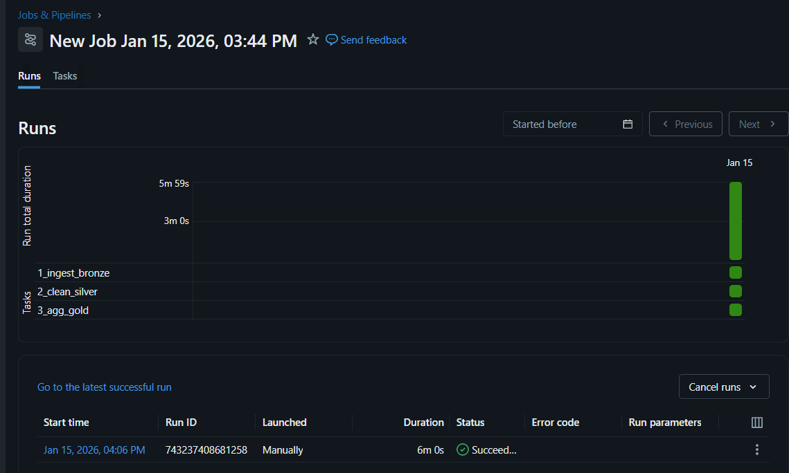

# Databricks 14-Days of AI Challenge

---

## 📖 About This Repository

**"Consistency is the bridge between goals and accomplishment."**

This repository documents my journey through the **Databricks 14-Days of AI Challenge**, an initiative organized by the [Indian Data Club (IDC)](https://www.linkedin.com/company/indian-data-club/) and sponsored by [Databricks](https://databricks.com/) and [Codebasics](https://codebasics.io/).

The purpose of this repo is to move beyond passive tutorial watching and transition into active implementation. Over the next two weeks, I will be committing code, notebooks, and study notes here to cement my understanding of the Databricks platform and modern AI workflows.

My goal for this year is simple: **Learn, Share, and Contribute.**

## 🎯 Challenge Goals

In this repository, I aim to:

* 🌱 **Explore real-world AI concepts** rather than just theoretical abstractions.
* 🚀 **Solve practical, industry-level challenges** that simulate actual data science environments.
* 🛠️ **Sharpen technical skills** directly on the Databricks platform (Lakehouse, PySpark, MLflow).
* 📚 **Document daily takeaways** to assist others in the community who are on a similar path.

## 🏁 Getting Started

Before diving into the daily challenges, I have set up the necessary environment:
1.  **Dataset:** Downloaded from Kaggle.
2.  **Platform:** Created an account on Databricks Community Edition.
3.  **Data Ingestion:** Uploaded data to DBFS/Workspace.

## 🗓️ Curriculum & Progress Log

### 🔹 Phase 1: Foundation (Days 1-4)
| Day | Date | Topic | Status | Links / Notes |
| :---: | :---: | :--- | :---: | :--- |
| **01** | 09/01/26 | **Platform Setup & First Steps** | ⬜ | Updated in Day Branch |
| **02** | 10/01/26 | **Apache Spark Fundamentals** | ⬜ | Updated in Day Branch |
| **03** | 11/01/26 | **PySpark Transformations Deep Dive** | ⬜ | completed(11-01-26, 23:50) |
| **04** | 12/01/26 | **Delta Lake Introduction** | ⬜ | completed(12-01-26, 20:10) |

### 🔹 Phase 2: Data Engineering (Days 5-8)
| Day | Topic | Status | Links / Notes |
| :---: | :--- | :---: | :--- |
| **05** | **Delta Lake Advanced** | ⬜ | [Coming Soon] |
| **06** | **Medallion Architecture** | ⬜ | [Coming Soon] |
| **07** | **Workflows & Job Orchestration** | ⬜ | [Coming Soon] |
| **08** | **Unity Catalog Governance** | ⬜ | [Coming Soon] |

### 🔹 Phase 3: Advanced Analytics (Days 9-11)
| Day | Topic | Status | Links / Notes |
| :---: | :--- | :---: | :--- |
| **09** | **SQL Analytics & Dashboards** | ⬜ | [Coming Soon] |
| **10** | **Performance Optimization** | ⬜ | [Coming Soon] |
| **11** | **Statistical Analysis & ML Prep** | ⬜ | [Coming Soon] |

### 🔹 Phase 4: AI & ML (Days 12-14)
| Day | Topic | Status | Links / Notes |
| :---: | :--- | :---: | :--- |
| **12** | **MLflow Basics** | ⬜ | [Coming Soon] |
| **13** | **Model Comparison & Feature Engineering** | ⬜ | [Coming Soon] |
| **14** | **AI-Powered Analytics: Genie & Mosaic AI** | ⬜ | [Coming Soon] |

### 🏆 Capstone Project Week (Days 15-21)
| Day | Focus | Description |
| :---: | :--- | :--- |
| **15-21** | **Final Project** | A self-directed week to choose a problem, find a dataset, architect a solution, and build a portfolio-worthy project. |

## 🚀 Day 7: Workflow Orchestration
**Goal:** Automate the Medallion Architecture (Bronze -> Silver -> Gold) using Databricks Workflows.

### 📂 Key Files
* [`Day 7 - Workflows.ipynb`](./Day7.ipynb): The controller notebook containing the logic for all 3 layers.
* [`job_config.json`](./day_07_job_config.json): The full Databricks Job definition (IaC) exported from the workspace.

### 🛠️ Architecture
I implemented a **Multi-Task Job** with dependencies:
1.  **Ingest (Bronze):** Ingests raw CSVs.
2.  **Clean (Silver):** Depends on Bronze; validates schema.
3.  **Agg (Gold):** Depends on Silver; calculates business KPIs.

## 💻 Tech Stack

* **Platform:** Databricks Community Edition / Professional
* **Languages:** Python, SQL
* **Libraries:** PySpark, Pandas, Scikit-Learn, MLflow, Delta Lake
* **Visualization:** Matplotlib, Seaborn

## 🙏 Acknowledgments

A huge shoutout to the organizers for putting this challenge together and fostering a community of learning:
* **Indian Data Club (IDC)**
* **Databricks**
* **Codebasics**

## 🤝 Connect

I am always open to discussing Data Science, AI, and Databricks. Feel free to connect!

---
*If you are also participating in the challenge, feel free to fork this repo or reach out—I'd love to have an accountability partner!*
